# SnapBooth

SnapBooth adalah aplikasi photobooth kiosk untuk mendukung bisnis sewa jasa photobooth pada berbagai acara, seperti seminar, wedding, pesta, dan acara kelulusan. Aplikasi ini dirancang agar tamu dapat menyelesaikan seluruh sesi secara mandiri, mulai dari pembayaran, pengambilan foto, pemilihan desain, hingga menerima foto fisik dan softfile.

## Tujuan Proyek

- Menyediakan pengalaman photobooth yang cepat, interaktif, dan mudah digunakan oleh tamu event.
- Membantu operator mengelola konfigurasi event, frame, kamera, printer, voucher, dan data operasional dari satu panel admin.
- Menghasilkan foto strip siap cetak serta aset digital yang dapat diunduh melalui QR code.
- Menjadi fondasi produk untuk layanan photobooth berbayar maupun gratis di berbagai jenis acara.

## Fitur

### Alur Tamu

- Layar pembuka atau attract screen dengan branding event dan tombol mulai.
- Mode event berbayar atau gratis.
- Pembayaran melalui QRIS dengan timer pembayaran serta dukungan voucher dan kupon.
- Pemilihan template frame bawaan atau frame custom yang disediakan operator.
- Pilihan jumlah cetakan, termasuk biaya tambahan untuk copy ekstra.
- Akses kamera webcam dengan countdown, mirror preview, dan pengambilan beberapa pose.
- Review setiap foto dan retake pose dengan batas retake yang dapat dikonfigurasi.
- Filter foto sebelum hasil akhir dirender.
- Pembuatan foto strip atau layout 4R siap cetak.
- Pembuatan Live Motion Video dan GIF boomerang dari sesi foto.
- Cetak otomatis dan opsi reprint selama kertas masih tersedia.
- QR code untuk membuka halaman softfile di perangkat tamu.
- Halaman download mobile untuk foto strip HD, video, GIF, foto per pose, dan paket ZIP.
- Tombol share melalui Web Share API atau menyalin link ke clipboard.
- Softfile kedaluwarsa otomatis setelah 1 jam.

### Panel Admin

- Mengubah judul, subtitle, tanggal, lokasi, harga, mode event, countdown, dan batas retake.
- Mengatur kamera, printer, jumlah copy default, harga copy tambahan, dan auto-reset sesi.
- Mengunggah, menghapus, menyembunyikan, dan mengaktifkan frame custom.
- Mengatur tampilan attract screen, termasuk media latar dan teks CTA.
- Membuat voucher gratis, diskon persentase, diskon nominal, serta batch kode VIP.
- Melihat status kertas, jumlah cetakan, dan melakukan reprint sesi terakhir.
- Melihat statistik sesi, pendapatan, frame favorit, filter, dan log event.
- Menyalin laporan ringkas operasional untuk dibagikan melalui WhatsApp.
- Mengekspor data/aset event dalam bentuk ZIP.

## Tech Stack

- **Frontend:** React 19, React DOM
- **Build tool dan dev server:** Vite 6
- **Styling:** Tailwind CSS 4 dengan `@tailwindcss/vite`
- **Icon:** Lucide React
- **Image processing:** HTML Canvas API
- **Media:** MediaDevices API, MediaRecorder API, `gifshot`
- **QR code:** `qrcode`
- **Packaging:** `jszip`
- **Animation:** `canvas-confetti`
- **Utility:** `clsx`, `tailwind-merge`
- **Local persistence:** `localStorage` browser
- **File storage saat development:** Vite custom middleware ke `public/uploads`
- **Mobile access saat development:** Cloudflare Tunnel melalui `untun`

## Persyaratan

- Node.js 18 atau lebih baru
- npm
- Webcam yang dapat diakses browser untuk sesi foto langsung
- Printer foto yang terhubung jika ingin menguji cetak fisik
- Browser modern dengan dukungan `getUserMedia`, MediaRecorder, dan Web Share API

## Cara Menjalankan

1. Clone atau buka folder proyek, lalu masuk ke direktori SnapBooth.

2. Install dependency:

   ```bash
   npm install
   ```

3. Jalankan development server:

   ```bash
   npm run dev
   ```

4. Buka URL yang ditampilkan Vite, biasanya:

   ```text
   http://localhost:5173
   ```

5. Izinkan akses kamera saat diminta browser. Pada perangkat lain di jaringan yang sama, gunakan alamat IP lokal yang ditampilkan aplikasi atau URL Cloudflare Tunnel jika berhasil dibuat.

### Perintah Lain

```bash
npm run build    # Membuat production build di folder dist
npm run preview  # Menjalankan preview dari production build
```

## Cara Mencoba Demo

1. Pada attract screen, tekan tombol mulai.
2. Pilih frame dan jumlah cetakan.
3. Pada halaman pembayaran, gunakan tombol simulasi pembayaran atau masukkan voucher yang tersedia, misalnya `VIPFREE`, `PANITIA`, atau `PROMO50`.
4. Izinkan kamera, ikuti countdown, lalu ambil seluruh pose.
5. Periksa hasil foto, lakukan retake jika diperlukan, dan pilih filter.
6. Tunggu hasil akhir diproses. Aplikasi akan menampilkan hasil cetak, QR code, GIF, dan motion video jika tersedia.
7. Scan QR code menggunakan perangkat lain untuk menguji halaman download tamu.

## Catatan Implementasi

- Pembayaran QRIS pada versi ini adalah simulasi UI. Belum ada verifikasi transaksi dari payment gateway.
- Data pengaturan, voucher, statistik, status printer, dan metadata softfile disimpan di `localStorage` browser.
- Saat development, aset softfile disimpan oleh endpoint Vite ke `public/uploads`.
- Vite mencoba membuat Cloudflare Tunnel otomatis agar QR dapat dibuka dari jaringan seluler. Jika tunnel gagal, aplikasi menggunakan IP lokal atau origin saat ini.
- File softfile akan dibersihkan setelah kurang lebih 1 jam. Untuk produksi, gunakan backend dan object storage dengan autentikasi, validasi pembayaran, serta kebijakan retensi yang sesuai.
- Integrasi printer bergantung pada printer dan konfigurasi perangkat yang digunakan di venue.

## Struktur Direktori Utama

```text
src/
├── components/   # Layar tamu dan panel admin
├── context/      # State dan alur sesi photobooth
└── utils/        # Render canvas, filter, GIF, storage, dan packaging
public/uploads/   # File softfile yang dibuat saat development
```

## Screenshot yang Disarankan

Untuk dokumentasi, proposal bisnis, atau presentasi, ambil screenshot berikut:

1. **Attract screen:** tampilan awal dengan branding event dan tombol mulai.
2. **Payment screen:** QRIS, ringkasan harga, pilihan jumlah cetakan, dan input voucher.
3. **Frame selection screen:** daftar template frame dan kontrol jumlah copy.
4. **Camera session screen:** live preview kamera dengan countdown dan indikator pose.
5. **Review/retake screen:** hasil beberapa pose dengan tombol retake.
6. **Filter screen:** preview hasil foto dan pilihan filter.
7. **Print and share screen:** hasil foto strip, status printer, QR code, dan countdown auto-reset.
8. **Guest download screen:** halaman mobile setelah QR discan, terutama tab foto strip dan tombol download.
9. **Guest download media:** tab Live Motion Video, GIF Boomerang, dan foto per pose.
10. **Admin panel - event settings:** konfigurasi event, harga, countdown, kamera, dan printer.
11. **Admin panel - frame management:** frame bawaan/custom serta form upload frame.
12. **Admin panel - voucher dan analytics:** daftar voucher, statistik sesi, pendapatan, dan status kertas.

Untuk screenshot yang paling penting dalam pitch bisnis, prioritaskan nomor **1, 3, 4, 7, 8, dan 10** agar calon klien dapat melihat pengalaman tamu sekaligus kemampuan operator.

## Galeri Screenshot

### Alur Tamu

#### Attract Screen

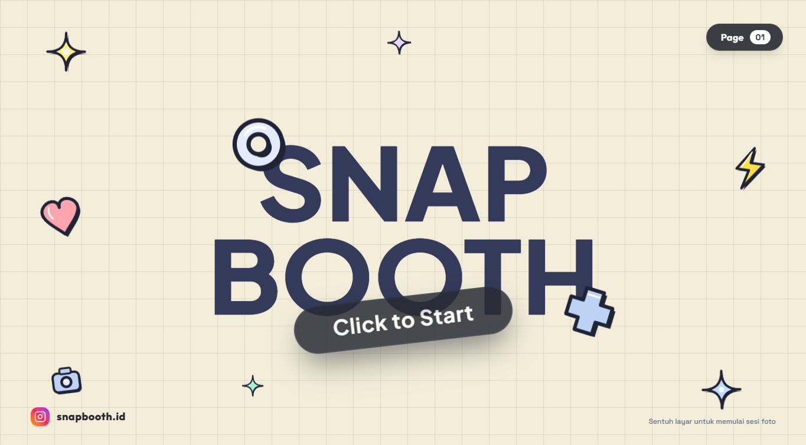

#### Payment Screen

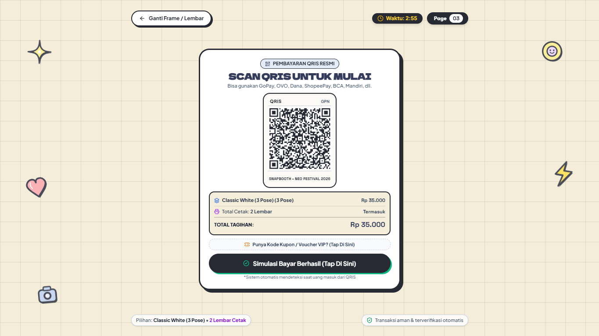

#### Frame Selection Screen

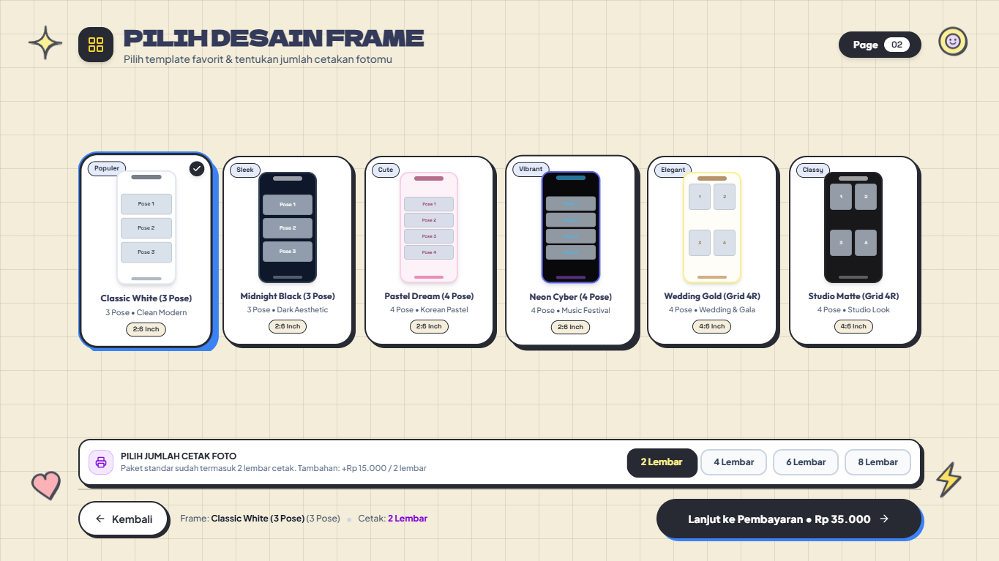

#### Camera Session Screen


#### Review and Retake Screen

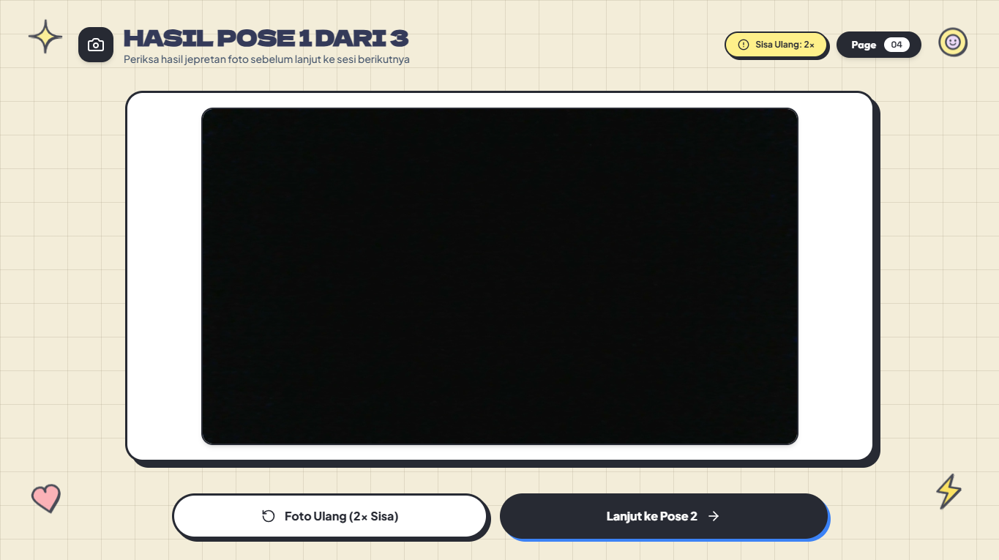

#### Filter Screen

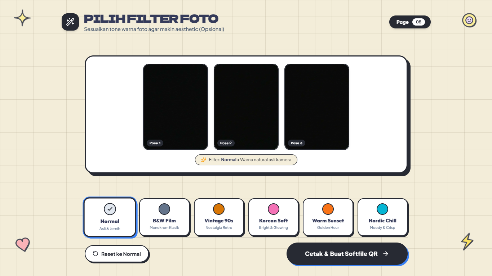

#### Print and Share Screen

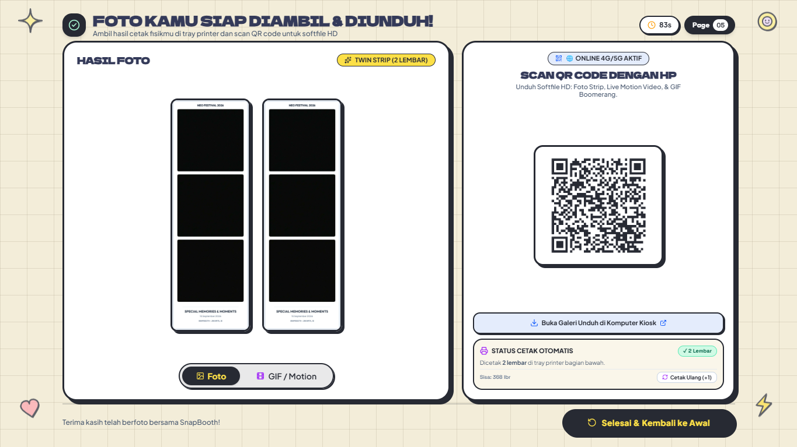

#### Guest Download Screen

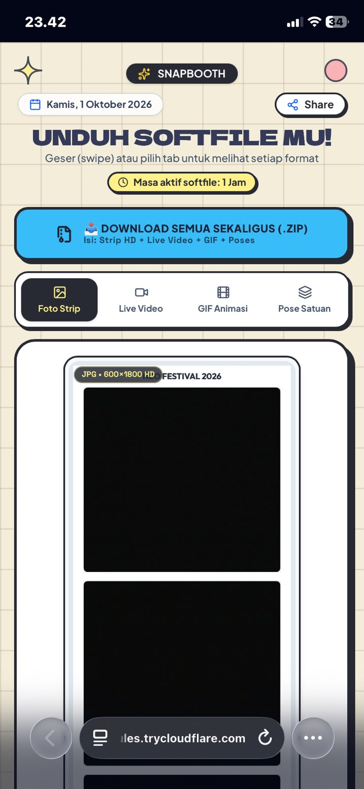

### Panel Admin

#### Event Settings

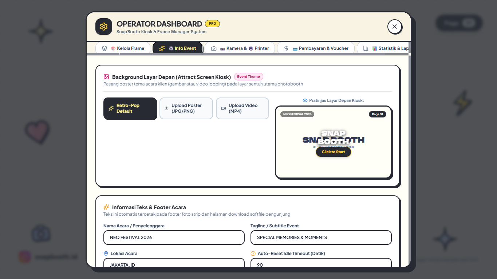

#### Frame Management

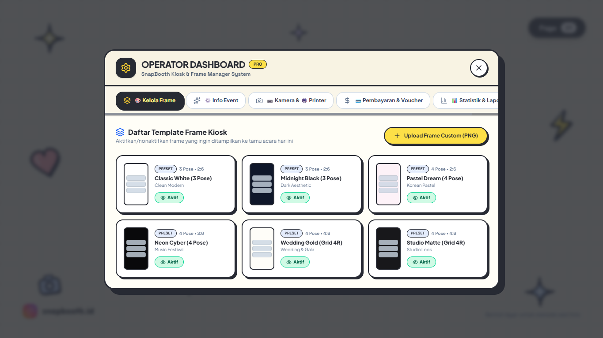

#### Voucher Management

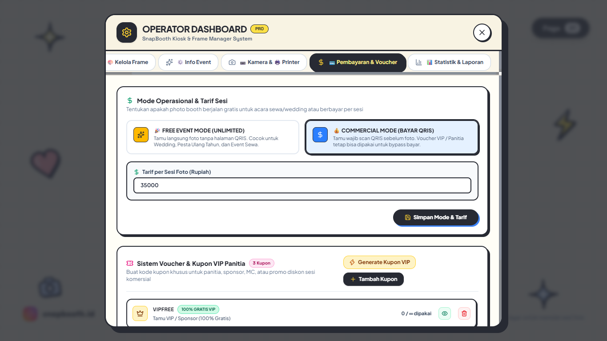

#### Analytics

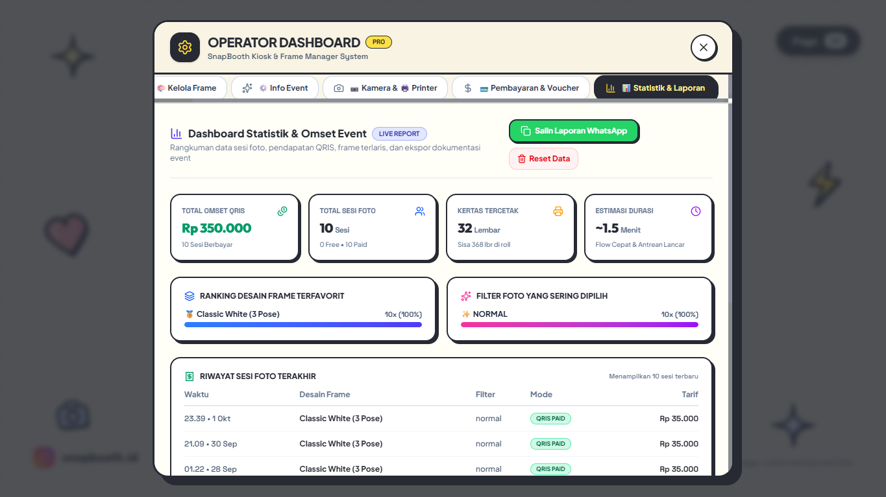

## Lisensi

Proyek ini menggunakan lisensi yang tercantum pada file [LICENSE](LICENSE).
"# SnapBooth"
